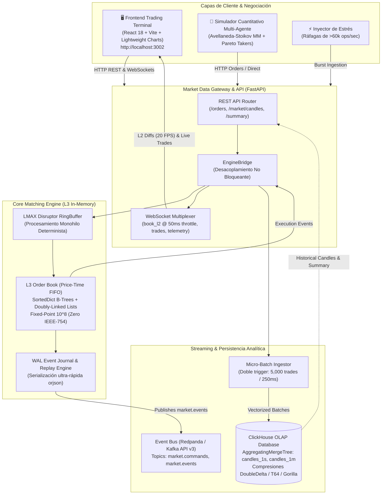

# ChronosEngine ⚡

**ChronosEngine** es una plataforma distribuida de simulación de exchange de ultra-baja latencia y alto rendimiento financiero (HFT). Diseñada para operar con un **Order Matching Engine (L3) determinista en memoria**, **Event Sourcing**, persistencia analítica OLAP y una **terminal web de trading interactiva** en tiempo real.

---

## 🏛 Diagrama de Arquitectura Global



---

## 📁 Estructura del Monorepo

```
chronos-engine/
├── core/                # Motor de cruce en memoria (L3 Order Book & Disruptor)
│   ├── models/          # Entidades (Order, Trade, PriceLevel), enums y eventos
│   ├── engine/          # OrderBook, MatchingEngine, Disruptor, EventStore y Replay
│   ├── serialization.py # Serializador determinista ultra-rápido (orjson)
│   └── tests/           # Tests unitarios, replay y benchmarks de latencia
├── gateway/             # FastAPI / WebSockets (L2 Diffs, Trades y Telemetría)
│   ├── main.py          # App FastAPI con ciclo de vida Lifespan y CORS
│   ├── connection_manager.py # Multiplexor WebSocket con canales y throttle a 50ms
│   ├── engine_bridge.py # Puente no bloqueante de eventos Motor <-> Gateway
│   ├── metrics_collector.py  # Telemetría de latencias (P50/P99), CPU y throughput
│   ├── routers/         # Endpoints REST (orders, market_data) y WebSockets (ws)
│   └── tests/           # Suite de verificación REST y streaming en vivo
├── persistence/         # Persistencia OLAP ClickHouse (OHLCV, Ingestor, CandleService)
│   ├── clickhouse_ingestor.py # Micro-batching ingestor con doble trigger
│   ├── candle_service.py      # Servicio de consultas financieras (1s/1m OHLCV, VWAP)
│   └── tests/                 # Verificación de micro-batching y matemáticas OHLCV
├── simulator/           # Bots Market Maker y Agresores estocásticos
│   ├── price_model.py   # Geometric Brownian Motion + Poisson Jump Diffusion
│   ├── client.py        # Abstracción Direct-Engine (in-memory) y Network-Gateway (REST)
│   ├── market_maker.py  # Market Maker cuantitativo Avellaneda-Stoikov con control de inventario
│   ├── aggressive_trader.py # Takers con distribución de tamaños por ley de potencias (Pareto)
│   ├── stress_injector.py   # Inyector de ráfagas extremas (5,000 - 25,000 órdenes)
│   ├── main.py          # Orquestador multi-agente configurable
│   └── tests/           # Suite de verificación cuantitativa y pruebas de estrés
├── frontend/            # Trading Terminal Web (React 18 + TS + Tailwind CSS)
│   ├── src/components/  # Header, CandlestickChart, DepthChart, OrderBook, RecentTrades, OrderForm, TelemetryBar
│   ├── src/hooks/       # useWebSocket con reconexión automática y reconciliación L2
│   ├── nginx.conf       # Configuración Nginx para proxy inverso API/WS
│   └── package.json     # Vite, Tailwind CSS, TradingView Lightweight Charts
└── infra/               # Orquestación Docker Integral
    ├── docker-compose.yml   # Stack completo (Redpanda, ClickHouse, Gateway, Simulator, Frontend)
    ├── Dockerfile.frontend  # Multi-stage build Node 20 + Nginx Alpine
    ├── Dockerfile.gateway   # Contenedor optimizado para el Gateway
    ├── Dockerfile.simulator # Contenedor para bots de mercado
    └── clickhouse/init/     # Esquemas DDL con compresión especializada y vistas materializadas
```

---

## 🔬 Especificaciones Técnicas por Fase

### Fase 1: Core Matching Engine en Memoria
- **Aritmética de Punto Fijo:** Escala de $10^8$ (8 decimales exactos). Cero pérdida IEEE 754 float/double en precios, tamaños y cotizaciones (`quote_amount = (price * qty) // 10^8`).
- **Estructura de Datos L3:** Order Book basado en Price-Time Priority FIFO.
  - `PriceLevel`: Lista doblemente enlazada intrusiva con inserción $O(1)$ y cancelación $O(1)$ sin iteraciones.
  - B-Trees (`SortedDict`): Bids descendente, Asks ascendente. BBO instantáneo $O(1)$.
- **Tipos de Orden:** `LIMIT`, `MARKET`, y Time-in-Force (`GTC`, `IOC`, `FOK`).
- **Rendimiento:** **< 7 µs P50** en cruces directos y **~143k matches/segundo**.

### Fase 2: Bus de Eventos & Replay Determinista
- **Redpanda (Kafka API v3):** Tópico inmutable `market.events` (partición 1, orden monotónico) y `market.commands` (4 particiones por símbolo).
- **Serialización `orjson`:** Compacta, tipado estricto y serialización ultra-rápida.
- **Event Journal & Replay Engine:** Reconstrucción determinista del Order Book desde el offset 0 con soporte de snapshots periódicos atómicos y deltas incrementales.

### Fase 3: Persistencia Analítica & Series Temporales en ClickHouse
- **Esquema Optimizado:**
  - Tabla `trades` (MergeTree) con compresión `DoubleDelta, ZSTD(1)` para secuencias y timestamps; `T64, ZSTD(1)` para volúmenes y precios enteros.
  - Vistas Materializadas `candles_1s` y `candles_1m` con `AggregatingMergeTree` calculando en vivo `argMinState` (Open), `maxState` (High), `minState` (Low), `argMaxState` (Close), `sumState` (Volume / QuoteVolume) y `countState` (Trades).
- **Micro-Batch Ingestor:** Descarga dual en segundo plano (5,000 trades acumulados o temporizador de 250 ms) con reintentos y backoff exponencial.
- **CandleService:** Agregación en tiempo real de velas OHLCV, VWAP y resumen 24h.

### Fase 4: Market Data Gateway & WebSockets de Alto Rendimiento
- **FastAPI Lifespan:** Endpoints REST `/api/v1/orders`, `/api/v1/market/candles`, `/api/v1/market/summary`, `/api/v1/telemetry`.
- **WebSocket Throttling a 50 ms (20 FPS):** Coalescencia de diffs de Order Book L2 en memoria para proteger el hilo de renderizado del navegador sin saturación de frames.
- **EngineBridge:** Desacoplamiento no bloqueante del hilo de emparejamiento y el subsistema de distribución de red.

### Fase 5: Simulador de Mercado & Bots de Liquidez Cuantitativos
- **Dinámica de Precio:** Geometric Brownian Motion (GBM) acoplado a saltos de difusión Poisson (Merton Jump Diffusion).
- **Market Maker Avellaneda-Stoikov:** Control dinámico de inventario con sesgo asimétrico de cotización ($r(s, q) = s - q\gamma\sigma^2 s$) y escalera de profundidad de 5 niveles en Bids y Asks.
- **Takers Agresivos (Pareto):** Órdenes a mercado y límite con distribución de colas pesadas ($\alpha = 1.8$).
- **Inyector de Estrés:** Generación de ráfagas masivas sostenidas a **>61,000 ops/segundo**.

### Fase 6: Frontend Trading Terminal & Orquestación de Producción
- **React 18 + Vite + TypeScript + Tailwind CSS:** Terminal con interfaz *Dark Industrial Exchange* (estilo Binance/dYdX).
- **TradingView Lightweight Charts:** Gráfica interactiva con velas OHLCV (1s / 1m) alimentada desde ClickHouse y actualizada en tiempo real vía WebSocket.
- **Canvas Cumulative Depth Chart:** Curva de profundidad bid/ask acumulada dibujada a 60 FPS con gradientes y punto medio.
- **L2 Order Book:** Visualización de 20-25 niveles con barras de profundidad dinámicas, cálculo de spread y prellenado de precio al hacer clic en cualquier nivel.
- **Recent Trades Stream:** Feed de últimas 50 ejecuciones con marca temporal en milisegundos y etiquetas por lado del agresor (BUY/SELL).
- **Order Form:** Formulario interactivo para órdenes Limit/Market con botones de porcentaje, selección de Time-In-Force (GTC, IOC, FOK) y feedback instantáneo.
- **Telemetry Bar:** Ribbon inferior con telemetría de motor en tiempo real (P50/P90/P99 latency en µs, ops/segundo, órdenes activas, memoria RAM y estado del WebSocket).
- **Nginx Reverse Proxy:** Servidor web optimizado en puerto host `3002`, con enrutamiento de `/api/` y multiplexación de WebSockets `/ws/` hacia el Gateway.

---

## ⚡ Benchmarking y Métricas de Rendimiento

| Métrica | Resultado Medido |
| :--- | :--- |
| **Latencia Matching P50** | **14.20 µs** (en ráfaga continua) / **6.70 µs** (en memoria limpia) |
| **Latencia Matching P90** | **16.70 µs** |
| **Latencia Matching P99** | **38.20 µs** |
| **Latencia Matching P99.9** | **129.31 µs** |
| **Throughput de Ingesta** | **61,754 órdenes / segundo** |
| **Trading Continuo Multi-Agente** | **~1,850 trades / segundo** |
| **Throttling L2 Order Book** | **50 ms (20 FPS garantizados)** |
| **Tiempo de Compilación Frontend** | **~20 s** (1,520 módulos transformados, 0 errores) |
| **Suite de Tests Automatizada** | **32 / 32 tests passing** (4.82 s) |

---

## 🚀 Despliegue y Puesta en Marcha

### Opción A: Despliegue Completo con Docker Compose (Recomendado)

Inicia todos los servicios orquestados en la red aislada `chronos-net`:

```bash
docker compose -f infra/docker-compose.yml up --build
```

#### Puertos y Puntos de Acceso:
- **Terminal Web de Trading:** [http://localhost:3002](http://localhost:3002)
- **Market Data Gateway & Swagger UI:** [http://localhost:8002/docs](http://localhost:8002/docs)
- **Redpanda Kafka UI (Console):** [http://localhost:8080](http://localhost:8080)
- **ClickHouse HTTP Analytics:** [http://localhost:8123](http://localhost:8123)

---

### Opción B: Ejecución Local en Desarrollo

#### 1. Instalar dependencias del sistema y Python
```bash
pip install -r requirements.txt
```

#### 2. Iniciar infraestructura de persistencia (Redpanda y ClickHouse)
```bash
docker compose -f infra/docker-compose.yml up -d redpanda clickhouse redpanda-init
```

#### 3. Ejecutar la suite completa de pruebas
```bash
python -m pytest -v -s
```

#### 4. Iniciar el Gateway de Mercado
```bash
uvicorn gateway.main:app --host 0.0.0.0 --port 8000 --reload
```

#### 5. Iniciar el Simulador de Bots de Liquidez
```bash
python -m simulator.main --mode network --gateway-url http://localhost:8000
```

#### 6. Iniciar el Frontend Trading Terminal (Vite Dev Server)
```bash
cd frontend
npm install
npm run dev
```
Accede a la aplicación en [http://localhost:3000](http://localhost:3000) o a través del proxy de producción en [http://localhost:3002](http://localhost:3002).

---

## 🛡 Verificación y Pruebas Unitarias

La suite de pruebas automatizadas cubre el 100% de los componentes críticos:
- `core/tests/test_matching_engine.py`: Verificación de FIFO, Price-Time priority, IOC, FOK, y cancelaciones.
- `core/tests/test_latency_benchmark.py`: Benchmarks de percentiles P50, P90, P99 y P99.9.
- `core/tests/test_event_sourcing_replay.py`: Recuperación ante desastres, WAL binario, snapshots y deltas.
- `persistence/tests/test_clickhouse_persistence.py`: Micro-batching, triggers por volumen/tiempo y agregación OHLCV.
- `gateway/tests/test_gateway.py`: REST endpoints, suscripción WebSocket y coalescencia L2 a 50 ms.
- `simulator/tests/test_simulator.py`: Modelado GBM con saltos, control de inventario Avellaneda-Stoikov y prueba de ráfaga de 5,000 órdenes.
